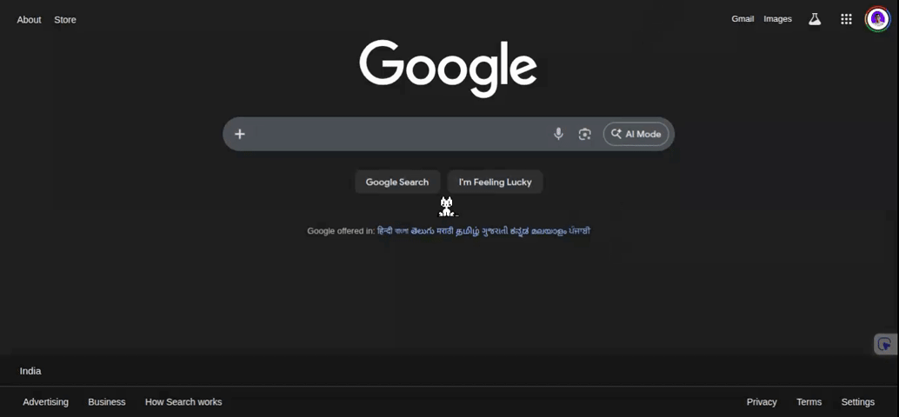

# Cat Pet Extension 

## Description
A cute pixel-art cat that lives in your browser! It follows your cursor, runs when you move, and breathes calmly when you stop. It's the perfect browsing companion —*Vibe Coded (Antigravity)*

## Demo

## Features
- **Follows Cursor**: Runs after your mouse with a smooth animation.
- **Smart Idle**: Sits down and breathes when you stop moving.
- **Pixel Perfect**: Retro sprite art style.
- **Universal**: Works on all websites (`<all_urls>`).

## Installation (Developer Mode)
Since this extension is in development, you need to load it manually:

1. **Download/Clone** this project folder to your computer.
2. Open Google Chrome and type `chrome://extensions` in the address bar.
3. Toggle the **Developer mode** switch in the top right corner.
4. Click the **Load unpacked** button that appears.
5. Select the folder containing this `README.md` file (the root folder).
6. The "Cat Pet" extension should now appear in your list!

## Usage
- The cat starts automatically on any new page you visit.
- If it doesn't appear immediately, try refreshing the page.
- You can click the **Cat Pet** icon in your toolbar to see it's active.

Enjoy your new pet! 🐱
